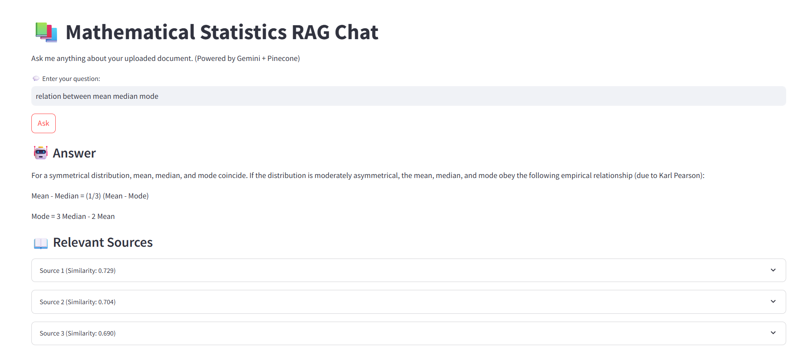

# Mathematical-Statistics-RAG-Chat
# 📚 Mathematical Statistics RAG Chat

A sophisticated Retrieval-Augmented Generation (RAG) application that enables interactive Q&A with the comprehensive textbook **Fundamentals of Mathematical Statistics** by S.C. Gupta and V.K. Kapoor. This project combines modern AI technologies to create an intelligent study assistant for mathematical statistics.

## 📖 About the Source Material

This application is built around the renowned textbook **Fundamentals of Mathematical Statistics** by **S.C. Gupta** and **V.K. Kapoor**—a comprehensive resource that has been serving students and educators for over 50 years.

### Book Details
- **Authors**: S.C. Gupta and V.K. Kapoor  
- **Publisher**: Sultan Chand & Sons   
- **Pages**: Over 1,303 pages  
- **ISBN**: 81-7014-791-3   
- **Target Audience**: Undergraduate, Honours, and Post-graduate students of Mathematical Statistics  

The book covers topics including probability theory, statistical distributions, sampling theory, hypothesis testing, correlation analysis, regression, and advanced statistical inference methods.

## 🚀 Features

- **Interactive Chat Interface**: Streamlit-based web UI for seamless Q&A  
- **Advanced RAG Pipeline**: Retrieval with generation for accurate, context-aware responses  
- **Source Attribution**: Displays relevant text chunks with similarity scores  
- **Comprehensive Knowledge Base**: 1,303 pages processed into 3,097 searchable chunks  
- **Real-time Processing**: Fast query handling with detailed source references  

## 🏗️ Architecture

### Core Components

1. **Frontend (`app.py`)**  
   - Streamlit interface  
   - User query input and response display  
   - Source attribution with similarity scores  

2. **RAG Pipeline (`rag_pipeline.py`)**  
   - Query embedding generation  
   - Vector similarity search via Pinecone  
   - Context-aware response generation with Gemini  

3. **Document Processing (`embedding.ipynb`)**  
   - PDF loading and parsing (PyPDFLoader)  
   - Text chunking (RecursiveCharacterTextSplitter)  
   - Embedding generation (Google Generative AI)  
   - Vector upload to Pinecone

## 🖼 Screenshots

### Technology Stack

- **LLM**: Google Gemini 2.0 Flash  
- **Embeddings**: text-embedding-004  
- **Vector DB**: Pinecone  
- **Frontend**: Streamlit  
- **Doc Processing**: LangChain, PyPDF  

## 🛠️ Installation

### Prerequisites

- Python 3.8+  
- Google Generative AI API key  
- Pinecone API key and index  

